#  CapsStream

<p align="center">
  <strong>A modern, self-hosted, cinematic personal media server for your movies, series, and anime collection.</strong>
</p>

<p align="center">
  
  
  
  
  
  
</p>

---

Point CapsStream to your media folders. It automatically matches your titles against **TMDb**, fetches high-resolution posters, backdrops, cast info, and episode guides, and streams everything through a sleek, hardware-accelerated web player.

> **Important**: CapsStream is for your own personal media collection only. No media content is bundled or provided — you supply your own files.

---

## Screenshots

<p align="center">
  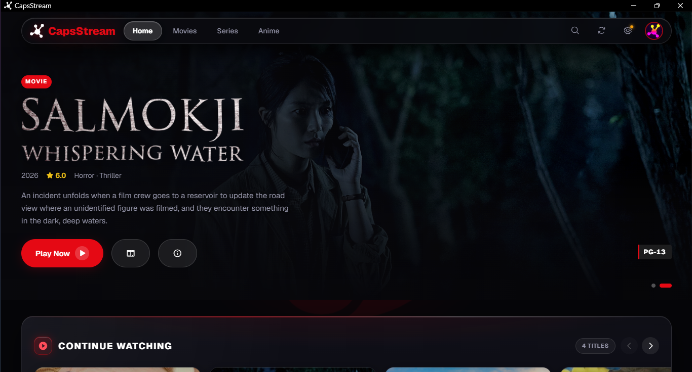
</p>
<p align="center"><em>Home — Cinematic hero backdrop banner with instant playback & details</em></p>

<p align="center">
  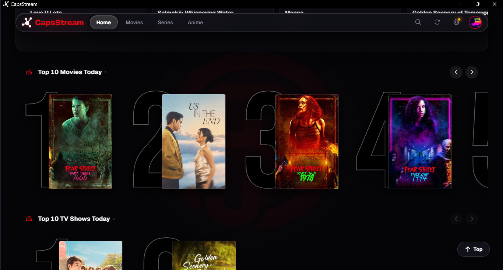
</p>
<p align="center"><em>Top 10 — Ranked Top 10 carousel with prominent stylized typographic numbers</em></p>

<p align="center">
  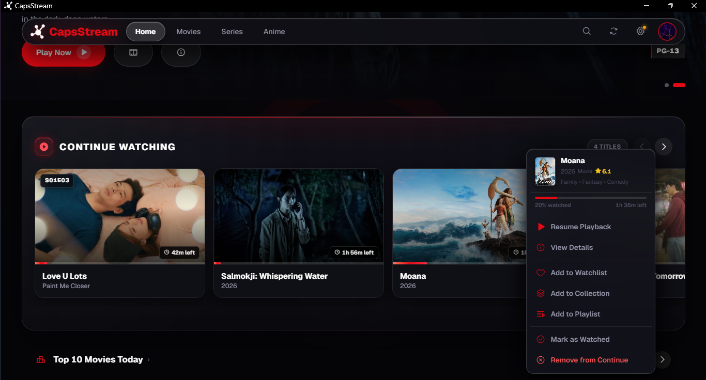
</p>
<p align="center"><em>Continue Watching — Dedicated resume shelf with exact visual progress tracking</em></p>

<p align="center">
  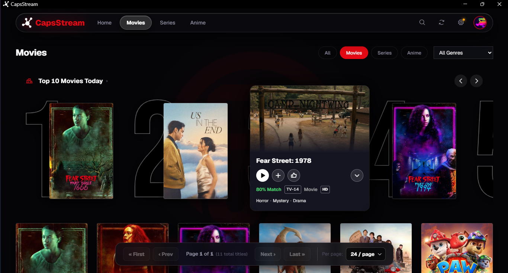
</p>
<p align="center"><em>Movies — Full movie collection with interactive genre chips, ratings, and video quality badges</em></p>

<p align="center">
  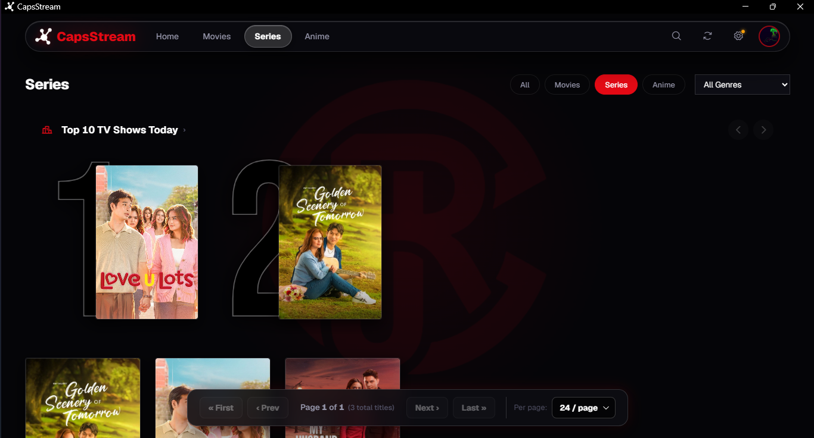
</p>
<p align="center"><em>Series & Anime — Organized TV library with season counts, episode badges, and missing episode tracking</em></p>

<p align="center">
  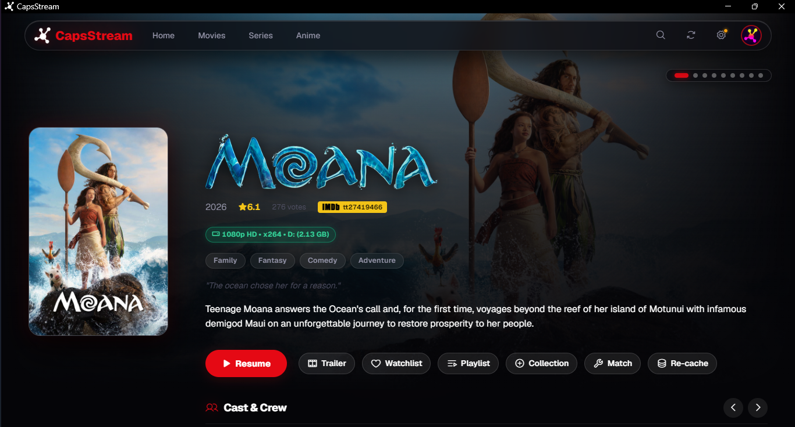
</p>
<p align="center"><em>Details — Full metadata view with backdrop artwork, synopsis, cast roster, and interactive season drawer</em></p>

<p align="center">
  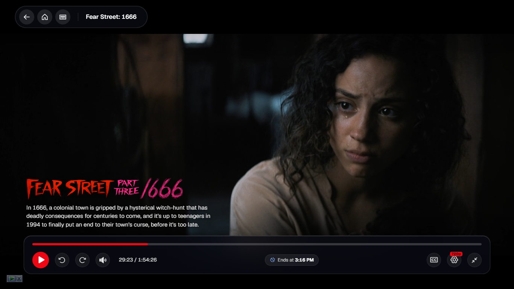
</p>
<p align="center"><em>Player — Modern floating glassmorphic dock controller with audio/subtitle track pickers and speed controls</em></p>

<p align="center">
  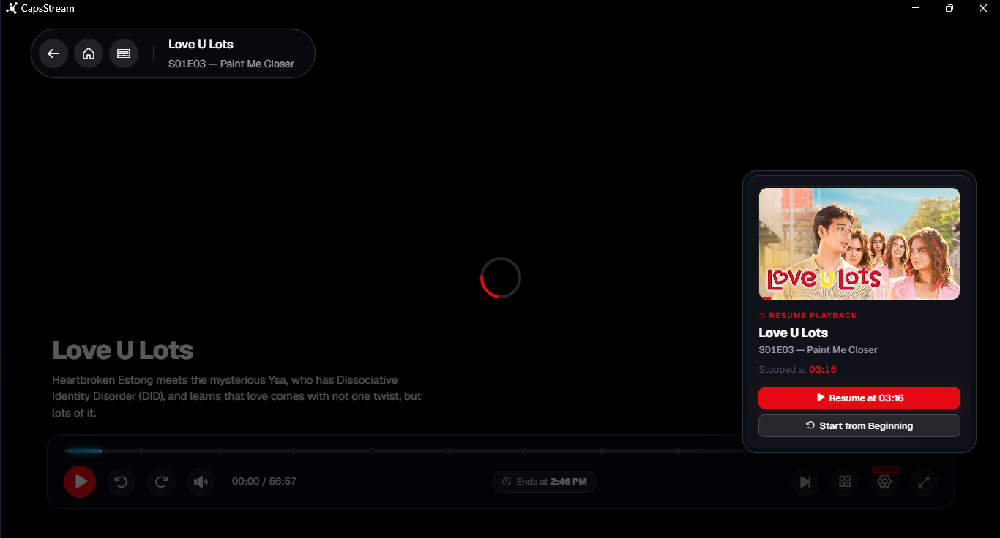
</p>
<p align="center"><em>Resume Playback — Non-intrusive resume card allowing seamless pickup right where you left off</em></p>

<p align="center">
  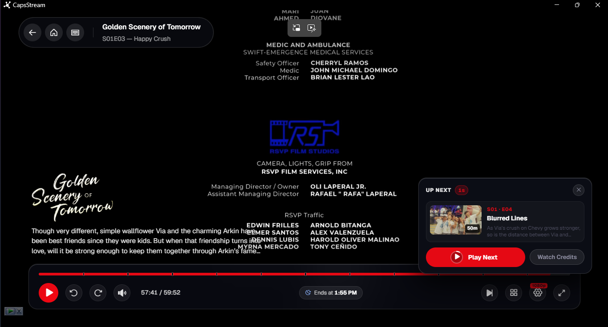
</p>
<p align="center"><em>Next Episode Overlay — 1:1 Netflix-style bottom-right floating card with circular countdown SVG ring and replay action</em></p>

<p align="center">
  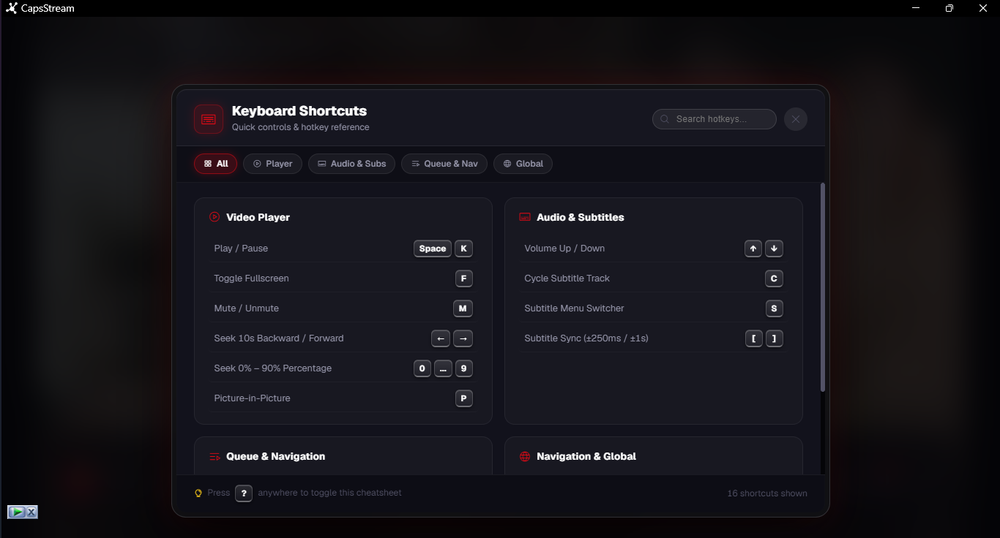
</p>
<p align="center"><em>Shortcuts Cheatsheet — Real-time searchable keyboard shortcuts cheatsheet modal (Press '?' anytime)</em></p>

<p align="center">
  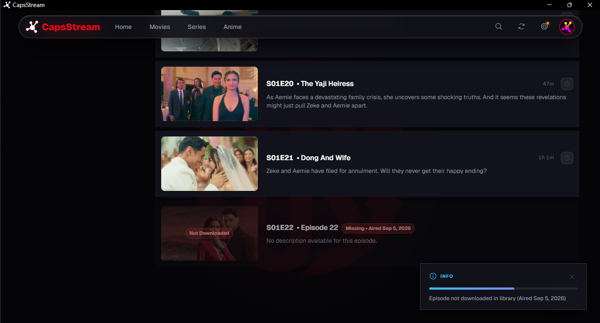
</p>
<p align="center"><em>Missing Episodes — TMDb-matched gap detection highlighting missing episodes and seasons at a glance</em></p>

<p align="center">
  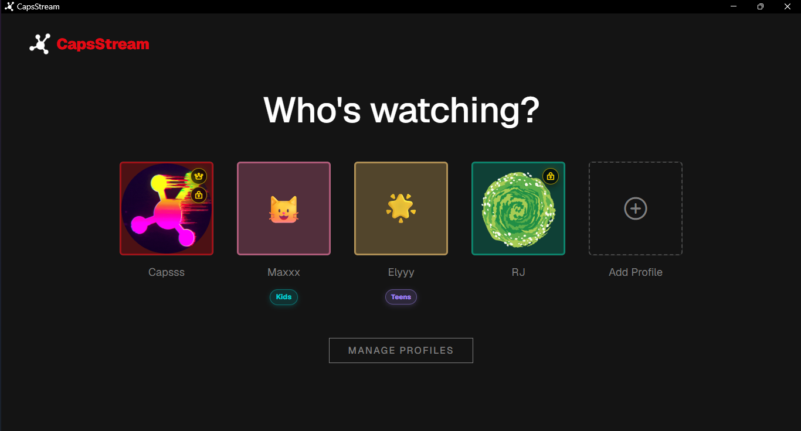
</p>
<p align="center"><em>Profiles — Multi-profile support with customizable avatars, PIN protection, and dedicated Kids mode</em></p>

<p align="center">
  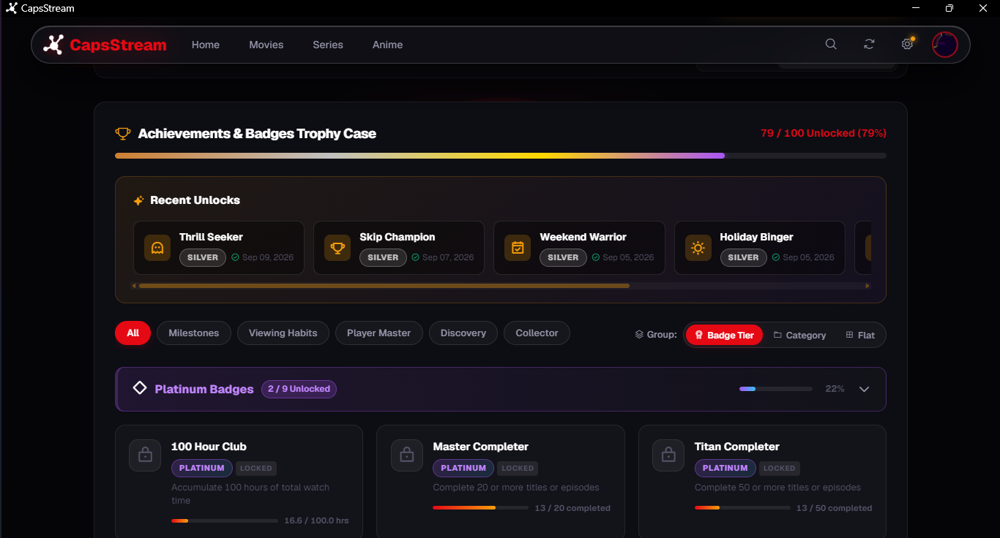
</p>
<p align="center"><em>Achievements — Unlock streaming milestones, earn trophies, and level up your viewer profile</em></p>

<p align="center">
  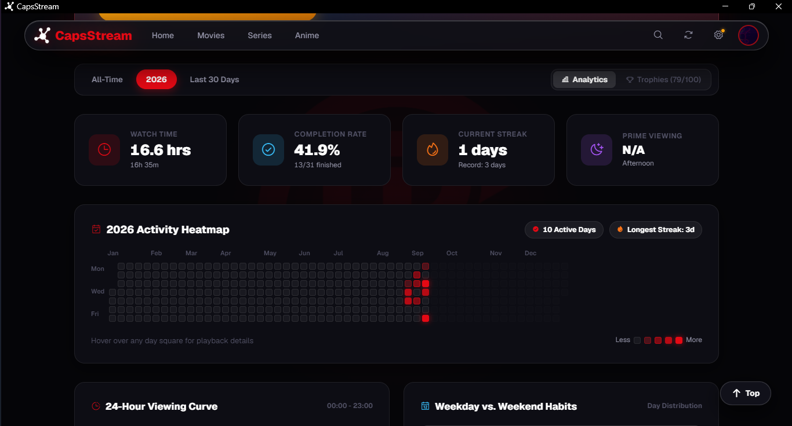
</p>
<p align="center"><em>Stats & Analytics — Track total hours watched, weekly viewing trends, and library breakdown</em></p>

<p align="center">
  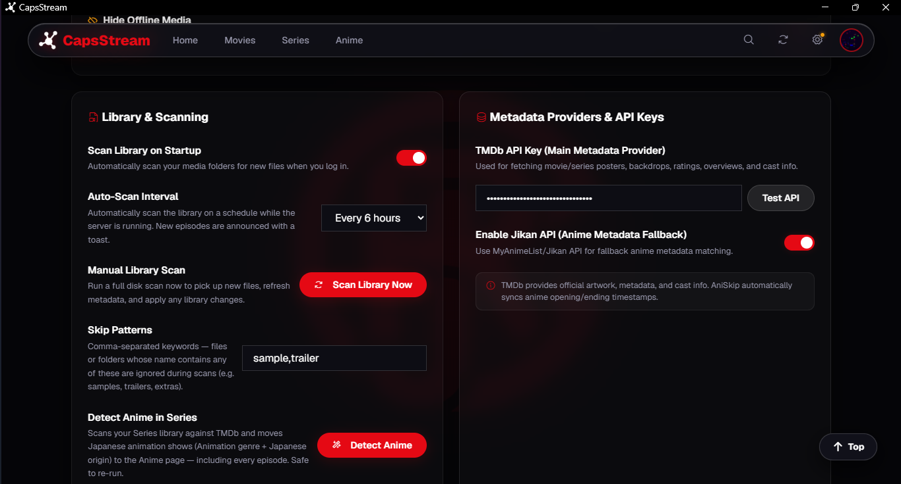
</p>
<p align="center"><em>Settings — Configure media library paths, TMDb API keys, hardware acceleration, and preferences</em></p>

---

## Why I Built CapsStream

CapsStream started as a personal project to help my uncle, who lives in an area with unreliable internet connectivity. While platforms like Jellyfin and Plex are powerful options, they can require more setup and ongoing maintenance. I also needed something simple enough to use without me being there to troubleshoot it when something goes wrong.

I initially stored the movies and TV shows he requested on a 1 TB external hard drive and sent it to him through my cousin. However, managing and browsing hundreds of media files without proper titles, posters, or episode information quickly became difficult.

To solve this, I built CapsStream — a lightweight, self-hosted media server focused on simplicity and portability. It transforms a folder of media files into a structured and easy-to-browse library without the complexity of a full media-server setup.

**What CapsStream Provides:**
- Automatic posters, descriptions, and episode metadata
- Subtitle support
- Organized movie and TV show libraries
- Local media playback without requiring an internet connection
- Runs directly from an external hard drive
- No complex installation or cloud service required

The application is designed to be portable: plug in the drive, run CapsStream, and the library is ready to use.

I continue to improve CapsStream with better media scanning, metadata handling, subtitle support, and interface improvements.

The goal is simple: make personal media collections easier to organize, manage, and enjoy — entirely on your own hardware.

---

## Quick Start (For Everyone / Non-Techy)

You do not need coding experience or complex terminal commands to run CapsStream. Follow these 3 simple steps:

### Step 1: Get CapsStream & Dependencies

1. **Download CapsStream** and extract it into a folder on your computer (e.g., `C:\CapsStream`).
2. **Download FFmpeg & FFprobe** (Required for video streaming & subtitles):
   * Download the Windows release build from **[gyan.dev FFmpeg Builds](https://www.gyan.dev/ffmpeg/builds/)** (choose `ffmpeg-release-essentials.zip`) or **[BtbN FFmpeg Releases](https://github.com/BtbN/FFmpeg-Builds/releases)**.
   * Open the downloaded ZIP, go to the `bin` folder, and copy `ffmpeg.exe` and `ffprobe.exe` into the `ffmpeg\bin\` folder inside your `CapsStream` folder (or add them to your Windows `PATH`).
3. **Get Python (Choose Option A or Option B)**:
   * **Option A (Portable - No install needed, Recommended)**: Download portable Python from **[WinPython](https://winpython.github.io/)** (or [WinPython Releases](https://github.com/winpython/winpython/releases)), extract it, and place the Python folder into `winpython\python\` inside your `CapsStream` folder.
   * **Option B (System-wide Installer)**: Download and install Python 3.12+ from **[python.org](https://www.python.org/downloads/)** (make sure to check *"Add Python to PATH"* during installation).

### Step 2: Get Your Free TMDb API Key
CapsStream uses The Movie Database (TMDb) to fetch movie/show posters, ratings, overviews, and cast info.
1. Create a free account at [themoviedb.org](https://www.themoviedb.org/signup).
2. Go to **[Settings → API](https://www.themoviedb.org/settings/api)** and generate a free API key (Developer option).
3. Open `.env` (or copy `.env.example` to `.env`) with Notepad and paste your key:
   ```env
   TMDB_API_KEY=your_copied_api_key_here
   ```
   *(You can also enter your API key directly inside the CapsStream web interface under Settings.)*

### Step 3: Launch & Enjoy
Double-click either of our one-click launchers:

* **`Start CapsStream Silent.vbs`** *(Recommended for daily use)*
  * Starts CapsStream seamlessly in app-mode with **no black console window**.
  * Shows native Windows notifications when the server is ready.
  * Automatically closes the background server when you close the browser window.
* **`start.bat`**
  * Launches CapsStream with a live log console (great for monitoring scans or troubleshooting).

Then open **http://127.0.0.1:8000** in your browser (Microsoft Edge or Google Chrome recommended).

---

## Adding Your Media Folders

1. Click the **Settings** icon in the top-right corner of the web interface.
2. Under **Media Scanner Paths**, add the folder paths for your content:
   * **Movies**: e.g., `D:\Media\Movies`
   * **Series**: e.g., `D:\Media\TV Shows`
   * **Anime**: e.g., `E:\Anime`
3. Click **Save Settings**, then click **Scan Library** on the Home page.
4. CapsStream will automatically scan your files, match metadata, fetch artwork, and organize your collection!

---

## Key Features

* **1:1 Netflix-Style Next Episode Overlay**: Non-blocking floating bottom-right preview card with a circular SVG countdown progress ring, episode synopsis, duration badge, and instant Play Next / Replay actions.
* **Floating Glassmorphic Player Dock**: Elevated player controller dock with specular border reflections, tactile controls, audio/subtitle selector drawers, playback speed menu, and chapter navigation.
* **Searchable Keyboard Shortcuts Cheatsheet**: Press `?` or `/` anywhere in the app to summon an elevated cheatsheet card with instant real-time search filtering.
* **Smart HLS & Hardware-Accelerated Transcoding**: Direct streaming with zero overhead, automatic GPU hardware transcoding (NVIDIA NVENC, Intel QSV, AMD AMF), and resilient CPU fallback for 4K HEVC, 10-bit HDR, and AV1 video.
* **Interactive Genre Chips & Quality Badges**: Sleek interactive genre chips and video quality badges adhering strictly to media source token priority (e.g. 1080p/720p UHD BluRay encodes accurately badged without defaulting to 4K).
* **Seekbar Frame Previews & Skip Markers**: Instant visual frame previews when hovering over the progress bar, plus one-click or automated skipping for intro, recap, and outro sequences (powered by AniSkip + custom markers).
* **Missing Episodes & Seasons Detection**: Automatically compares local files against TMDb seasons to identify missing episodes and collection gaps at a glance.
* **Multi-Profile, Kids Mode & Family PIN**: Custom avatar profiles, PIN-protected profiles, and automated age-appropriate content filtering for kids.
* **Achievements, Milestones & Profile Stats**: Gamified viewing statistics, level progression, and unlockable badges for binge sessions and milestones.
* **1-Click Backup & Restore**: Secure your library metadata, playlists, and watch histories directly from the Settings menu.
* **Built-in Auto-Updater**: One-click update check (`update.bat`) that pulls improvements without wiping your database, settings, or media paths.
* **Android TV Companion App**: Native Kotlin Android TV companion app with automatic UDP LAN discovery, TV layout auto-activation, and full D-pad remote control support.
* **Windows System Tray Companion**: Keeps CapsStream running silently in the background with a native tray icon — server stays alive even after the browser window closes.

---

## Companion Apps

CapsStream ships two lightweight companion clients that work alongside the main server.

### 🖥️ Windows System Tray

The tray companion runs automatically when you launch CapsStream via **`Start CapsStream Silent.vbs`**. It lives in your Windows notification area and lets you:

- **Open** the CapsStream web interface from the tray
- **Keep the server alive** after you close the browser window — no more accidentally killing the server
- **Quit** cleanly from the tray icon right-click menu

No extra setup needed — it starts with CapsStream automatically.

### 📺 Android TV Companion App

A native Android / Android TV app that connects to your CapsStream server over your local network.

**Features:**
- Automatic LAN discovery via UDP broadcast — just open the app and it finds your server
- Manual IP entry fallback if discovery doesn't work
- TV layout activated automatically — the full Netflix-style grid UI loads on launch
- D-pad and remote control navigation
- Works on Android phones, tablets, Android TV boxes, and Fire TV sticks

**Getting the APK:**

1. Go to the [**Releases**](https://github.com/Unknownplanet40/CapsStream/releases) section on GitHub.
2. Download the latest `CapsStream-AndroidTV-*.apk` from the release assets.
3. Install the `.apk` on your Android TV or Android device (enable *Install from unknown sources* in system settings).

*(Bleeding-edge pre-release builds are also available from the [Actions tab](https://github.com/Unknownplanet40/CapsStream/actions/workflows/build-android-tv.yml) under workflow artifacts).*

**Connecting to your server:**

> [!IMPORTANT]
> Your CapsStream server must be bound to `0.0.0.0` (not `127.0.0.1`) so it is reachable on your local network.

Open `config.json` and set:
```json
{
  "host": "0.0.0.0",
  "port": 8000
}
```
Then restart CapsStream. The Android app will discover the server automatically, or you can enter your PC's local IP (e.g. `192.168.1.5:8000`) manually.

---

## Advanced / Developer Installation

If you prefer installing and managing dependencies with standard Python:

```bat
# 1. Clone repository
git clone https://github.com/ryanj/CapsStream.git
cd CapsStream

# 2. Setup environment & install dependencies
python -m venv venv
venv\Scripts\activate
pip install -r requirements.txt

# 3. Setup configuration
copy .env.example .env
copy config.example.json config.json

# 4. Start the server
python app.py
```

---

## Troubleshooting & FAQ

| Issue | Solution |
|---|---|
| **Port 8000 already in use** | Open `config.json` in Notepad, change `"port": 8000` to `"port": 8001` (or another free port), and restart. |
| **No posters or metadata found** | Verify your TMDb API key in `.env` or in the in-app **Settings → API Keys** section. Ensure your folders/files follow standard naming (e.g. `Movie Name (Year).mp4` or `Show Name/Season 01/S01E01.mkv`). |
| **4K HEVC / HDR video stutters** | Use Microsoft Edge for hardware-accelerated HEVC/AC-3 playback, or click **"Play converted (1080p)"** in the player banner. |
| **Silent Launcher won't start** | Ensure portable Python exists in `winpython\python\pythonw.exe`, or run `start.bat` to check error messages. |
| **Missing FFmpeg error** | Download FFmpeg from [gyan.dev](https://www.gyan.dev/ffmpeg/builds/) and place `ffmpeg.exe` and `ffprobe.exe` in the `ffmpeg\bin\` folder, or add FFmpeg to your Windows `PATH`. |

---

## Project Structure

```
CapsStream/
├── Start CapsStream Silent.vbs # Zero-console app launcher with toast notifications
├── start.bat                   # Console launcher with live logging
├── update.bat                  # Safe auto-updater
├── app.py                      # Core Flask API & streaming engine
├── silent_launcher.py          # Background runner, tray companion & app-mode window manager
├── backend/
│   ├── tray.py                 # Windows system tray companion (pure Win32 ctypes)
│   ├── hls_transcoder.py       # Smart HLS & hardware-accelerated transcoding engine
│   └── ...                     # Library scanner, matcher, transcoding, database
├── clients/
│   └── android-tv/             # Android TV / Android companion app (Kotlin + Leanback)
├── static/                     # Frontend Vue 3 web application, styles & audio
├── templates/                  # Single-page HTML shell
├── data/                       # Local database, downloaded artwork & cache (ignored by git)
├── config.json                 # User configuration & preferences (ignored by git)
└── .env                        # Private API keys (ignored by git)
```

---

## License & Fair Use

CapsStream is licensed for personal, non-commercial use with media you legally own. All matched media artwork and metadata are provided by [TMDb](https://www.themoviedb.org/) and their respective copyright holders.
